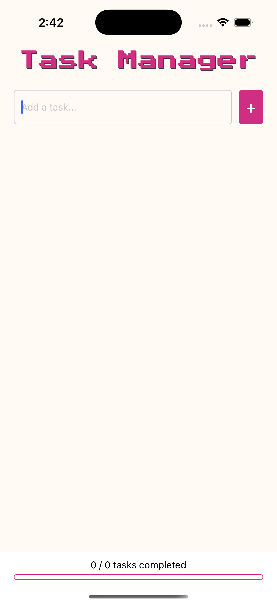
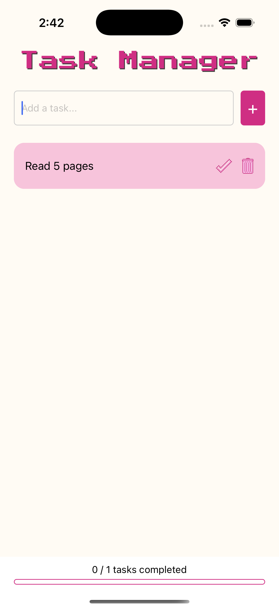
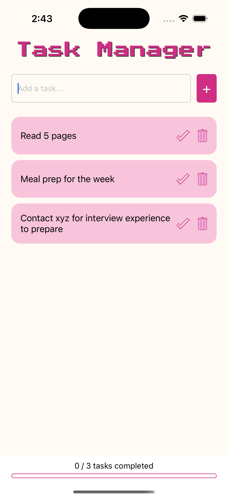
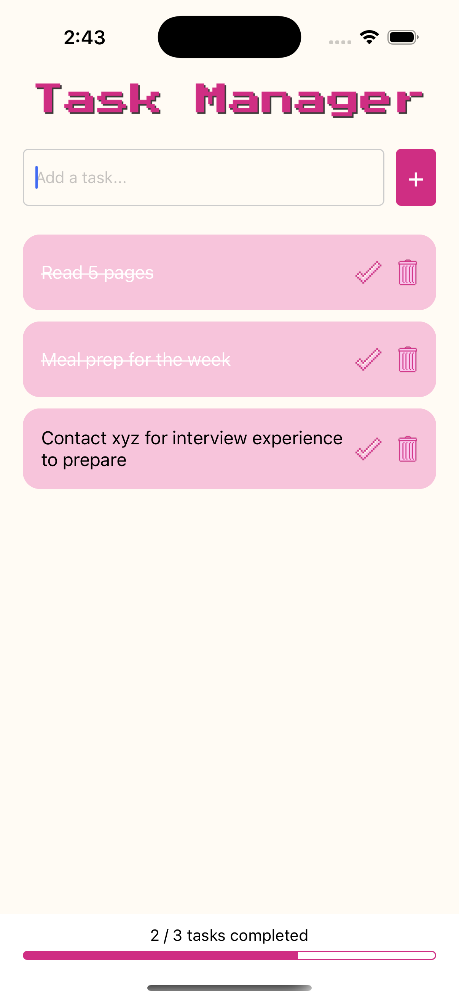
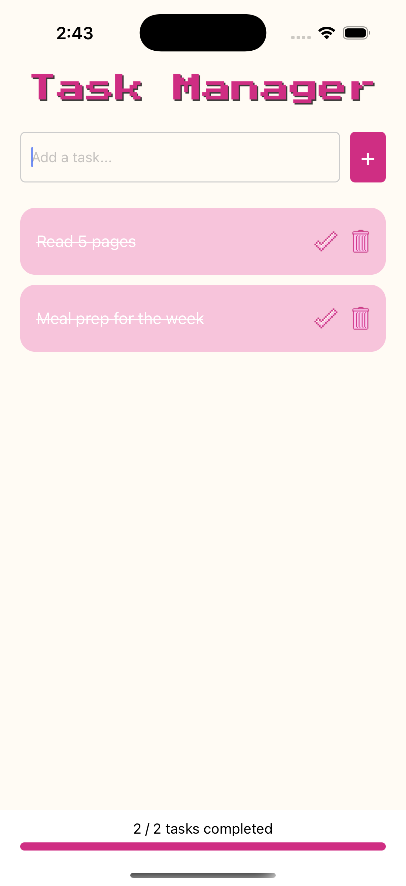

# Task Manager App  

A **React Native** Task Manager app . This app allows users to **add tasks**, **mark them as complete**, and **delete them**, with a **progress bar** to track task completion.  

---

## Features  
- **Add Task** – Users can add a new task with a description.  
- **Mark Task as Complete** – Completed tasks are visually distinguished.  
- **Delete Task** – Users can remove tasks from the list.  
- **Task List View** – Displays all tasks in a clean UI.  
- **Progress Bar** – Tracks and displays task completion progress.

---
## Development Process
Step 1: Setting Up the App
I started by setting up the project using Expo, which provided a smooth and quick environment for developing the React Native application.

Step 2: UI Planning with Canva
Before diving into the actual UI development, I used Canva to create a rough layout of how I wanted the app to look. This helped in visualizing the user interface and ensuring a clean and intuitive design.

Step 3: Building the UI
Once the plan was ready, I moved on to developing the UI using React Native components. The primary goal was to keep the interface simple, user-friendly, and responsive.

Step 4: Adding Functionality
Implemented state management using React's useState to handle task data.
Added features to add, complete, and delete tasks.

Step 5: Enhancing with a Progress Bar
At the end of the development process, I thought including a progress bar would be a great addition to visualize task completion. I implemented this using the react-native-progress library.

---

##  Screenshots   

<div style="display: flex; flex-wrap: wrap; gap: 10px;">
  <div>
    <p>Home Screen</p>
    
  </div>
  <div>
    <p>Added Task</p>
    
  </div>
  <div>
    <p>Wrapping Text</p>
    
  </div>
  <div>
    <p>Completing Task and Progress Bar</p>
    
  </div>
  <div>
    <p> Deleting Task</p>
    
  </div>
</div>


---

## Technologies Used  

- **React Native** – For building the mobile application  
- **Expo** – For quick setup and development  
- **react-native-progress** – For the task progress bar  

---

## Setup & Installation   

Ensure you have the following installed:  

- **Node.js** (v14 or later) – [Download here](https://nodejs.org/)  
- **Expo CLI** – Install globally:  
  ```bash
  npm install -g expo-cli
- **Clone the Repo**
- **npm install**
